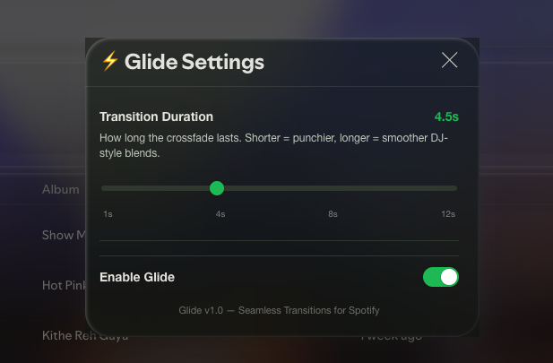
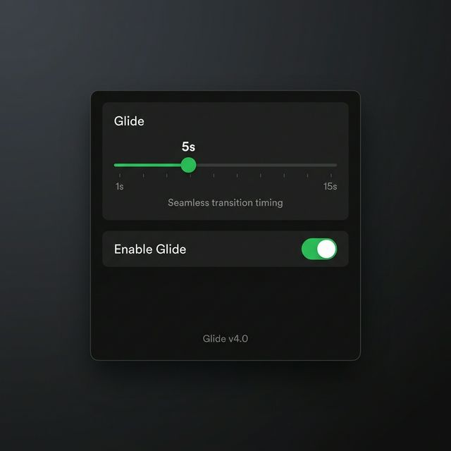

<div align="center">

# ⚡ Project Glide

**Apple Music-style seamless transitions for Spotify desktop.**

[](#)
[](#)
[](#)

</div>

<br/>

> **Demo / Preview**  
> *(Add a GIF here showing the early skip happening and crossfade working!)*  
> 

**Glide** is a Spicetify extension that brings true, DJ-like seamless crossfades to your Spotify desktop client. Unlike other extensions that simply ramp the volume up and down, Glide leverages **Spotify's native crossfade audio engine** to create a genuine audio overlap where the next track starts playing *before* the current one ends.

## ✨ Features

- **Apple Music-Style "Early Skip"**: The next song begins playing X seconds before the current song finishes, creating a perfect overlap.
- **True Audio Mixing**: Uses Spotify's internal audio engine for a native, zero-latency crossfade. No volume manipulation hacks.
- **Built-in UI**: Features a clean, Spotify-themed settings modal accessible directly from the Playbar.
  
  *(Add a screenshot of the settings UI here)*  
  

- **Customizable Timings**: Adjust the early start trigger and crossfade duration independently (1–15 seconds).
- **Profile Menu Integration**: Quick toggle to enable/disable Glide right from your Spotify profile dropdown.

---

## 🚀 Installation

### Prerequisites

You must have [Spicetify](https://spicetify.app/) installed and configured on your system.

### Install Steps

1. Download the `glide.js` file from this repository.
2. Copy `glide.js` into your Spicetify extensions directory:
   - **Windows:** `%appdata%\spicetify\Extensions`
   - **Linux/macOS:** `~/.config/spicetify/Extensions`
3. Run the following commands in your terminal to apply the extension:

   ```bash
   spicetify config extensions glide.js
   spicetify apply
   ```

---

## ⚙️ Setup & Configuration

**⚠️ CRITICAL STEP: Enable Spotify's Native Crossfade**  
For Glide to work its magic, you must enable Spotify's built-in crossfade engine.

1. Open Spotify and go to **Settings > Playback**.
2. Toggle on **Crossfade songs**.
3. Set the slider to your preferred overlap duration (e.g., `5s`).

### Using the Glide UI

Once installed, you'll see a lightning bolt icon (⚡) in your Spotify playbar. Click it to open the **Glide Settings**:

- **Early Start ⏮️**: Controls how many seconds before the current song ends to skip to the next song.
- **Crossfade Duration 🔊**: Controls how long the audio overlap lasts (this should match whatever you set in Spotify's Settings).
- **Test Transition 🧪**: Click this while a song is playing to instantly test your crossfade settings!

---

## 🧠 How it Works

Previous attempts at crossfade extensions manually reduced the volume of Song A, triggered a skip, and increased the volume of Song B. This creates a noticeable dip in volume and no true overlap.

**Glide (v3.0)** fixes this by changing the architecture:

```text
Song A:  ████████████████████████████──────
Song B:              ──────████████████████████████████████
                     ↑
            Player.next() fires here
          (earlyStart seconds before Song A ends)
     Spotify's native crossfade mixes both audio streams natively!
```

By simply skipping early and letting Spotify handle the audio mixing, you get a genuine, studio-quality crossfade.

---

## 🛠️ Troubleshooting

- **Transitions aren't happening:** Ensure Glide is toggled ON (the playbar icon should be green).
- **The song skips, but there's a gap/silence:** You forgot to enable "Crossfade songs" in Spotify's main Settings menu!
- **Transitions trigger too early/late:** Adjust the "Early Start" slider in the Glide settings menu to fine-tune the timing.

---

## 📜 License

MIT License. Free to use, modify, and distribute. Developed for the Spicetify community.

---
*created with ❤️ by Janak Choudhary*
